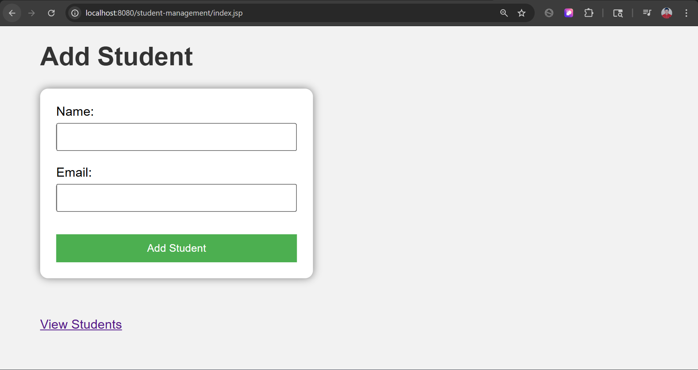
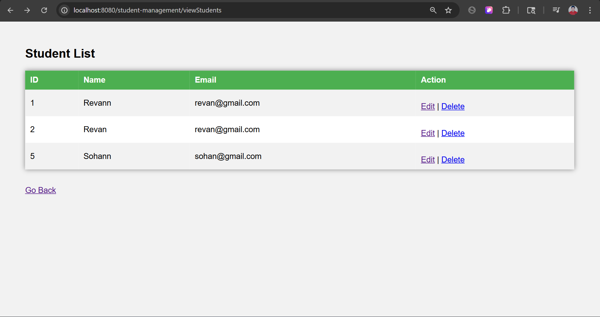
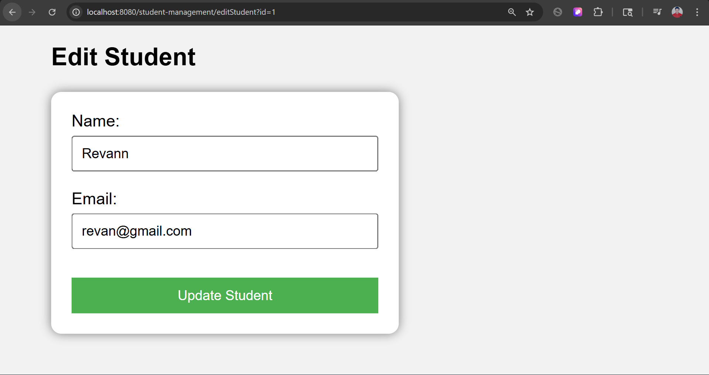

# 🎓 Student Management System

A simple **Student Management System** built using **Java Servlet, JDBC, and MySQL**.  
This project demonstrates CRUD operations with a clean UI and MVC architecture.

---

## 🚀 Features

- ➕ Add Student  
- 📋 View Students  
- ✏️ Update Student  
- ❌ Delete Student  
- 🎨 Clean UI with CSS  

---

## 🛠️ Tech Stack

- Java  
- Servlet (Jakarta EE)  
- JDBC  
- MySQL  
- Apache Tomcat  
- HTML, CSS  

---

## 📸 Screenshots

### 🏠 Add Student Page


### 📋 Student List


### ✏️ Edit Student


---

## ⚙️ Setup Instructions

1. Clone the repository  
2. Import project into Eclipse  
3. Configure MySQL database  

```sql
CREATE DATABASE student_db;

USE student_db;

CREATE TABLE students (
    id INT AUTO_INCREMENT PRIMARY KEY,
    name VARCHAR(100),
    email VARCHAR(100)
);
```

4. Set environment variable:

```
DB_PASSWORD=your_password
```

5. Run on Apache Tomcat server  

---

## 🔐 Security

Database password is stored using environment variables instead of hardcoding for better security.

---

## 📂 Project Structure

```
src/main/java/com/student/servlet
 ├── AddStudentServlet.java
 ├── ViewStudentsServlet.java
 ├── UpdateStudentServlet.java
 ├── DeleteStudentServlet.java
 ├── EditStudentServlet.java
 └── DBConnection.java

src/main/webapp
 ├── index.jsp
 ├── style.css
 └── WEB-INF
```

---

## 👨‍💻 Author

**Revan Khodade**

---

## ⭐ If you like this project

Give it a ⭐ on GitHub!
